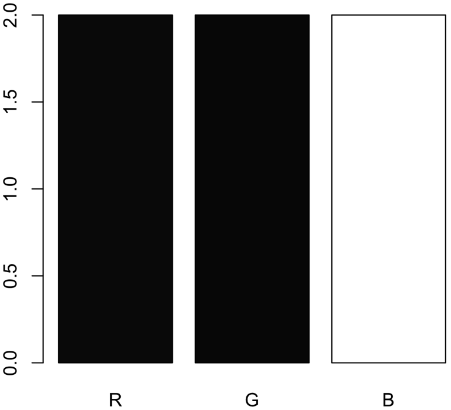

<!-- README.md is generated from README.Rmd. Please edit that file -->
```{r setup, include = FALSE}
knitr::opts_chunk$set(
  collapse = TRUE,
  comment = "#>",
  fig.path = "man/figures/README-",
  out.width = "100%",
  dpi = 400
)
```

# IPA: Image Processing & Analysis pipeline 

<!-- badges: start -->
<!-- `r badger::badge_devel("villegar/IPA", "blue")` -->
<!-- `r badger::badge_code_size("villegar/IPA")` -->
[](https://github.com/villegar/IPA/actions)
`r badger::badge_devel("villegar/MetaPipe", "blue")`
`r badger::badge_codecov("villegar/IPA")`
<!-- badges: end -->

## Overview

The goal of IPA is to provide a set of functions for image processing and analysis. 

## Installation

<!-- You can install the released version of IPA from [CRAN](https://CRAN.R-project.org) with: -->

<!-- ``` r -->
<!-- install.packages("IPA") -->
<!-- ``` -->

<!-- And the development version from [GitHub](https://github.com/) with: -->

You can install the development version from [GitHub](https://github.com/) with:
``` r
# install.packages(c("hexSticker", "remotes"))
remotes::install_github("villegar/IPA")
```

## Example
<!-- This is a basic example which shows you how to solve a common problem: -->
You should start by loading `IPA` on your session.
```{r example}
library(IPA)
```

### Remove background (`rm_background`)
This function removes the background from an image, based on a threshold value 
(`bkg_thr`). This can be found by creating a histogram of the image. 

```{r rm-background-example-data, cache = TRUE, echo = FALSE}
AB_001_B <- system.file("extdata", "AB_001_B.jp2", package = "IPA")
IPA::rm_background(AB_001_B, bkg_thr = 0.4)
AB_001_B_img <- imager::load.image(AB_001_B)
```

1. Start by loading the image to your workspace
```{r rm-background-example-data-code-step1, eval = FALSE}
AB_001_B <- system.file("extdata", "AB_001_B.jp2", package = "IPA")
AB_001_B_img <- imager::load.image(AB_001_B)
```

2. Plot the raw image
```{r rm-background-example-data-code-step2, cache = TRUE}
plot(AB_001_B_img)
```

3. Generate a pixel histogram
```{r rm-background-example-data-code-step3, cache = TRUE}
hist(AB_001_B_img, main = "Pixel histogram for AB_001_B")
```

Based on the histogram, we should look for pixel concentration (background), for
this example, the background is dark, so the threshould should be close to zero.

4. Call the `rm_background` function with the corresponding background threshold
 (`bkg_thr = 0.4` for the example image).
 
```{r rm-background-example-data-code-step4, eval = FALSE}
IPA::rm_background(image_path = AB_001_B, bkg_thr = 0.4)
```

5. Load the newly created image without background. By default, this new image
will be saved under the same path as the original one, with the same name, the
suffix `_wb` (without background, transparent), and extensiong `.png`.

```{r rm-background-example-data-code-step5, eval = TRUE}
AB_001_B_wb <- system.file("extdata", "AB_001_B_wb.png", package = "IPA")
AB_001_B_wb_img <- imager::load.image(AB_001_B_wb)
plot(AB_001_B_wb_img)
```

<!-- <table> -->
<!--   <thead> -->
<!--     <tr> -->
<!--       <th>Original</th> -->
<!--       <th>Without background</th> -->
<!--     </tr> -->
<!--   </thead> -->
<!--   <tbody> -->
<!--     <tr> -->
<!--       <td></td> -->
<!--       <td></td> -->
<!--     </tr> -->
<!--   </tbody> -->
<!-- </table> -->

```{r rm-background-example-data-code, eval = FALSE, echo = FALSE}
AB_001_B <- system.file("extdata", "AB_001_B.jp", package = "IPA")
IPA::rm_background(AB_001_B, bkg_thr = 0.4)
AB_001_B_wb <- system.file("extdata", "AB_001_B_wb.png", package = "IPA")
plot(imager::load.image(AB_001_B))
plot(imager::load.image(AB_001_B_wb))
```

### RGB decomposition (`rgb_decomposition`)
This function extracts each layer from an image as a matrix, for further processing.

1. Start by creating an example image, in this case a simple barplot
```{r rgb-decomposition-example-data, eval = FALSE}
test_data <- data.frame(name = c("R", "G", "B"), values = c(2, 2, 2))
RGB <- c("red", "green", "blue")
png("inst/figures/test_plot.png")
  barplot(height = test_data$values, names = test_data$name, col = RGB)
dev.off()
```

This code generates the following barplot (`inst/figures/test_plot.png`)


Which we want to decompose into 3 images:

<table>
  <thead>
    <tr>
      <th>Red layer</th>
      <th>Green layer</th>
      <th>Blue layer</th>
    </tr>
  </thead>
  <tbody>
    <tr>
      <td></td>
      <td></td>
      <td></td>
    </tr>
  </tbody>
</table>

For this purpose we can use the function `rgb_decomposition`, which can be called
as follows
```{r rgb-decomposition-fx-call, eval = FALSE}
rgb_decomposition(subdirectory, 
                  # optional
                  extension = "jpg", 
                  RData = TRUE, 
                  recursive = TRUE)
```
where `subdirectory` is the name of a directory where to search for the images. 
The other arguments are optional; `extension` is the file format of the images,
`RData` is a boolean flag to indicate whether or not the layers should be stored
as `RData` format or CSV, the latter requires more disk space. Finally, `recursive`
is a boolean flag on whether or not explore the `subdirectory` recursively for
more images.

2. Call the `rgb_decomposition` function to extract the layers of the example
image previously created:
```{r rgb-decomposition-example, eval = FALSE}
rgb_decomposition("inst/figures/", "png", recursive = FALSE)
```

After running this, three new files (per image) will be on disk, called 
`IMAGE-NAME-red.RData`, `IMAGE-NAME-green.RData`, and `IMAGE-NAME-blue.RData`.
