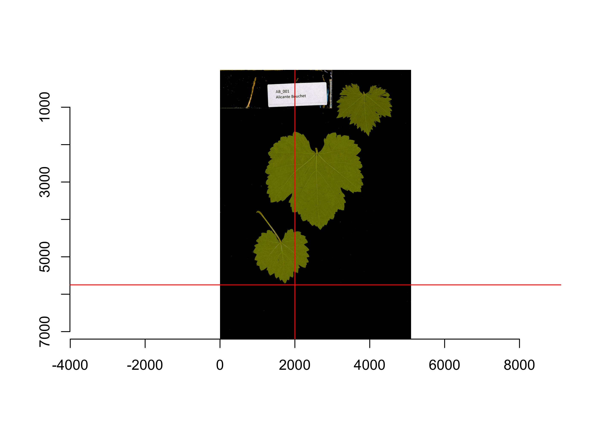
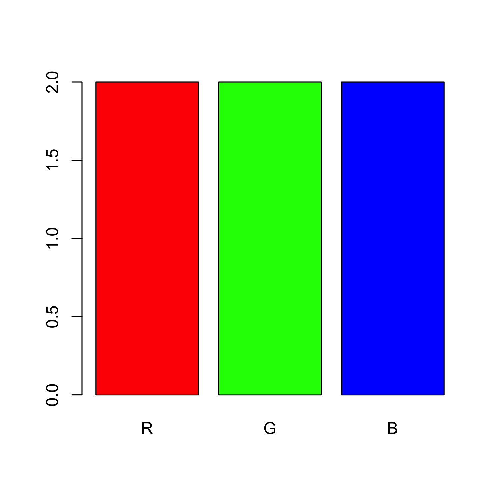

<!-- README.md is generated from README.Rmd. Please edit that file -->

# IPA: Image Processing & Analysis pipeline 

<!-- badges: start -->

<!-- [](https://github.com/villegar/IPA) -->

<!-- [](https://github.com/villegar/IPA) -->

[](https://github.com/villegar/IPA/actions)
[](https://github.com/villegar/MetaPipe)
[](https://codecov.io/gh/villegar/IPA)
<!-- badges: end -->

## Overview

The goal of IPA is to provide a set of functions for image processing
and
analysis.

## Installation

<!-- You can install the released version of IPA from [CRAN](https://CRAN.R-project.org) with: -->

<!-- ``` r -->

<!-- install.packages("IPA") -->

<!-- ``` -->

<!-- And the development version from [GitHub](https://github.com/) with: -->

You can install the development version from
[GitHub](https://github.com/) with:

``` r
install.packages("remotes") # if not installed
remotes::install_github("villegar/IPA")
```

## Example

<!-- This is a basic example which shows you how to solve a common problem: -->

You should start by loading `IPA` on your session.

``` r
library(IPA)
```

### Remove background (`rm_background`)

This function removes the background from an image, based on a threshold
value (`bkg_thr`). This can be found by creating a histogram of the
image.

Note: currently, it only removes dark backgrounds; a future version will
have an option for light backgrounds as well.

1.  Start by loading the image to your workspace

<!-- end list -->

``` r
AB_001_B <- system.file("extdata", "AB_001_B.jp2", package = "IPA")
AB_001_B_img <- imager::load.image(AB_001_B)
```

2.  (Optional) Plot the raw
image

<!-- end list -->

``` r
plot(AB_001_B_img)
```


3.  (Optional) Generate a “pixel histogram”

<!-- end list -->

``` r
hist(AB_001_B_img, main = "Pixel histogram for AB_001_B")
abline(v = 0.4, col = "red") # Mark bkg_thr 
```


Based on the histogram, we should look for pixel concentration
(background), for this example, the background is dark, so the threshold
should be close to zero.

4.  Call the `rm_background` function with the corresponding background
    threshold (`bkg_thr = 0.4` for the example image).

<!-- end list -->

``` r
IPA::rm_background(image_path = AB_001_B, bkg_thr = 0.4)
```

5.  Load the newly created image without background. By default, this
    new image will be saved under the same path as the original one,
    with the same name, the suffix `_wb` (without background,
    transparent), and extension
`.png`.

<!-- end list -->

``` r
AB_001_B_wb <- system.file("extdata", "AB_001_B_wb.png", package = "IPA")
AB_001_B_wb_img <- imager::load.image(AB_001_B_wb)
plot(AB_001_B_wb_img)
```


Note: the function `plot` displays transparent pixels as 0 (black)
values, that is why the previous plot shows a black background (to see
the transparent image, look up for the generated `*_wb.png`
file).

<!-- <table> -->

<!--   <thead> -->

<!--     <tr> -->

<!--       <th>Original</th> -->

<!--       <th>Without background</th> -->

<!--     </tr> -->

<!--   </thead> -->

<!--   <tbody> -->

<!--     <tr> -->

<!--       <td></td> -->

<!--       <td></td> -->

<!--     </tr> -->

<!--   </tbody> -->

<!-- </table> -->

6.  (Optional) Detect unwanted elements and remove them, this can be
    done by extracting the alpha channel (transparency layer) and using
    the function
`find_area`.

<!-- end list -->

``` r
alpha <- imager::channel(AB_001_B_wb_img, 4) # the alpha channel is the fourth one
blobs <- IPA::find_area(alpha, start = c(2000, 5750), px_tol = 500)
```

|   x0 | width |   y0 | height |
| ---: | ----: | ---: | -----: |
| 2000 |  3000 | 5750 |    500 |
| 2000 |  2500 | 5750 |   1450 |

Next, remove the previously detected objects, this can be done using the
function `add_alpha`.

``` r
for (a in seq_len(nrow(blobs))) {
  area <- as.numeric(blobs[a, ])
  AB_001_B_wb_img <- IPA::add_alpha(AB_001_B_wb_img, area = area)
}
plot(AB_001_B_wb_img)
abline(h = 5750, v = 2000, col = "red") # Mark the trimmed area
```



### Detect unwanted elements (`find_area`)

TODO

### Remove unwanted elements (`add_alpha`)

TODO

### RGB decomposition (`rgb_decomposition`)

This function extracts each layer from an image as a matrix, for further
processing.

1.  Start by creating an example image, in this case a simple barplot

<!-- end list -->

``` r
test_data <- data.frame(name = c("R", "G", "B"), values = c(2, 2, 2))
RGB <- c("red", "green", "blue")
png("inst/figures/test_plot.png")
  barplot(height = test_data$values, names = test_data$name, col = RGB)
dev.off()
```

This code generates the following barplot
(`inst/figures/test_plot.png`)



Which we want to decompose into 3 images:

<table>

<thead>

<tr>

<th>

Red layer

</th>

<th>

Green layer

</th>

<th>

Blue
layer

</th>

</tr>

</thead>

<tbody>

<tr>

<td>


</td>

<td>


</td>

<td>


</td>

</tr>

</tbody>

</table>

For this purpose we can use the function `rgb_decomposition`, which can
be called as follows

``` r
rgb_decomposition(subdirectory, 
                  # optional
                  extension = "jpg", 
                  RData = TRUE, 
                  recursive = TRUE)
```

where `subdirectory` is the name of a directory where to search for the
images. The other arguments are optional; `extension` is the file format
of the images, `RData` is a boolean flag to indicate whether or not the
layers should be stored as `RData` format or CSV, the latter requires
more disk space. Finally, `recursive` is a boolean flag on whether or
not explore the `subdirectory` recursively for more images.

2.  Call the `rgb_decomposition` function to extract the layers of the
    example image previously created:

<!-- end list -->

``` r
rgb_decomposition("inst/figures/", "png", recursive = FALSE)
```

After running this, three new files (per image) will be on disk, called
`IMAGE-NAME-red.RData`, `IMAGE-NAME-green.RData`, and
`IMAGE-NAME-blue.RData`.
